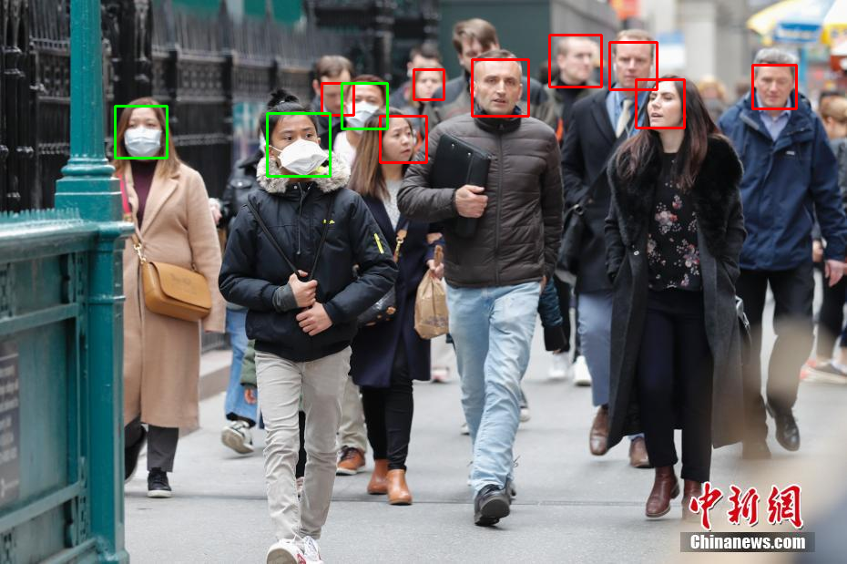
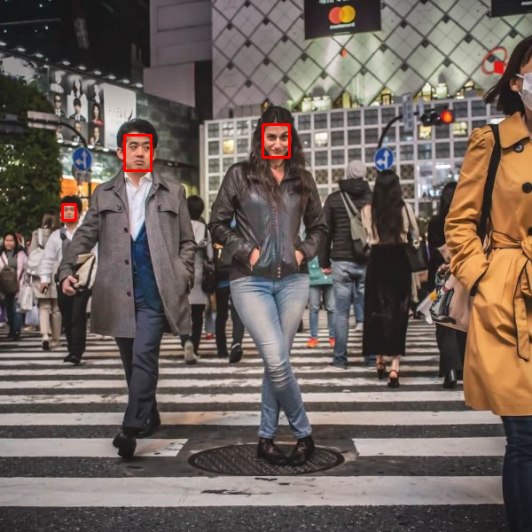
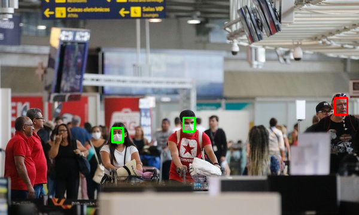
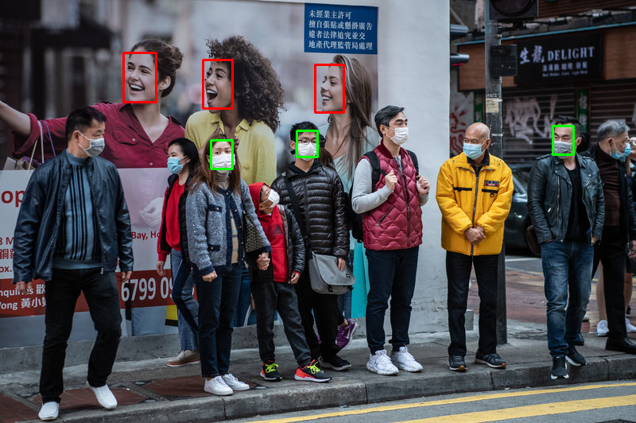

# covid_mask_detector
This project aims to, both, detect masks in a human face using a CNN, in a image of a public area, that may serve as sensor for the Corona Virus state in that region, and avaliating the impact of the use of image processing techniques in the data set of this problem, such as accuracy difference, cost/benefit ratio.

The assets used in this code includes 2 CNNs, one for mask detection coded and trained by me in the project: https://github.com/machadoprx/CoolConvNN

One for face detection: https://github.com/ipazc/mtcnn

Most of the data used in this project was obtained from: https://github.com/X-zhangyang/Real-World-Masked-Face-Dataset

The face detection can also be performed by the Viola Jones algorithm instead.

The differences between this methods can vary per image. After some testing, the VJ seen to be
the best solution for face detection, apart from its superior performance, it may have better
accuracy than the Deep Learning approach used.

# CNN Architecture for mask detection

<p align="center">
	</img>
</p>

# How to use:

1) Clone the repository

```
$ git clone https://github.com/machadoprx/covid_mask_detector.git
```

2) In repo folder extract data_set.tar.xz to any folder


3) Build new image data set for training in CoolConvNet (https://github.com/machadoprx/CoolConvNN). Note: Even if you do not want to use it for fit new data this program needs the data
mean and standard deviation to predict samples accurately

```
$ python3 data_set_enhancer.py make_data_set filter_name src_path
```

The currently available filters are laplace sharpening (laplace) and clahe 
(https://en.wikipedia.org/wiki/Adaptive_histogram_equalization)


4) Evaluate image, detecting faces and drawing boxes (red for unmasked and green for masked)

```
$ python3 data_set_enhancer.py test_image filter_name detection_method src_path
```

The available detection methods are Deep Learning approach (dnn) and Viola Jones algorithm (vj)

# About the CoolConvNet framework
In this application the CNN is already trained for mask detection, for further information about the framework and its use check the CoolConvNet repo.

You may want to use the CoolConvNet to fit new data, or try others architectures. Thus, you can use the already compiled code in this rep, after building the data set:

```
$ taskset -c 0,1,2,3 ./cnn_c new [epochs] [validation_set_split]
```

To continue training:

```
$ taskset -c 0,1,2,3 ./cnn_c continue [epochs] [validation_set_split]
```

WARNING: The weights of the already trained CNN, for mask detection, will be lost after the completion of the task above

The params.ini file define the architecture of the CNN, its structure can be found at: https://github.com/machadoprx/CoolConvNN

Compiled on: 
```
gcc (Clear Linux OS for Intel Architecture) 10.1.1 20200611 releases/gcc-10.1.0-174-g23dd425623
```

# Input and output example:

Detected faces will be evaluated, the boxes are green for people with masks and red for unmasked
After the corre

## Input image
<p align="center">
	</img>
</p>
<p align="center">
	</img>
</p>
<p align="center">
	</img>
</p>
<p align="center">
	</img>
</p>

## Viola Jones detection and histogram equalization

```
$ python3 data_set_enhancer.py test_image clahe vj das.jpg
```

<p align="center">
	</img>
</p>

## Deep learning detection and no filter applied

<p align="center">
	</img>
</p>

<p align="center">
	</img>
</p>

<p align="center">
	</img>
</p>

