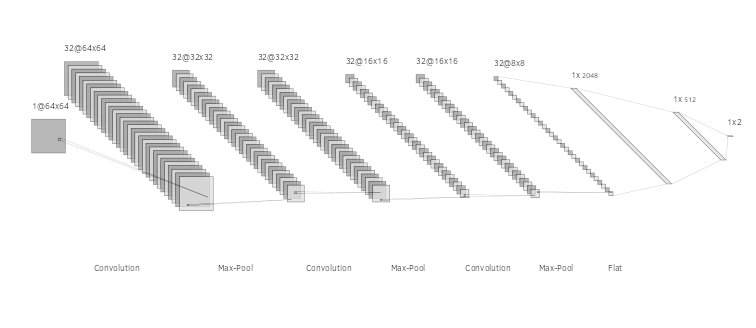
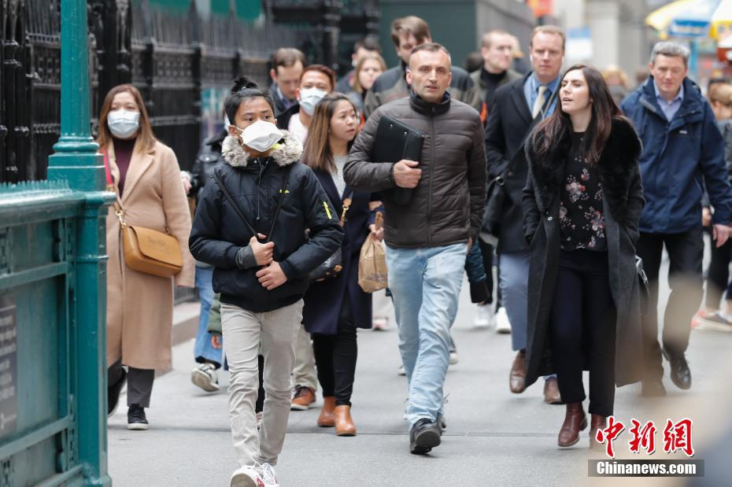
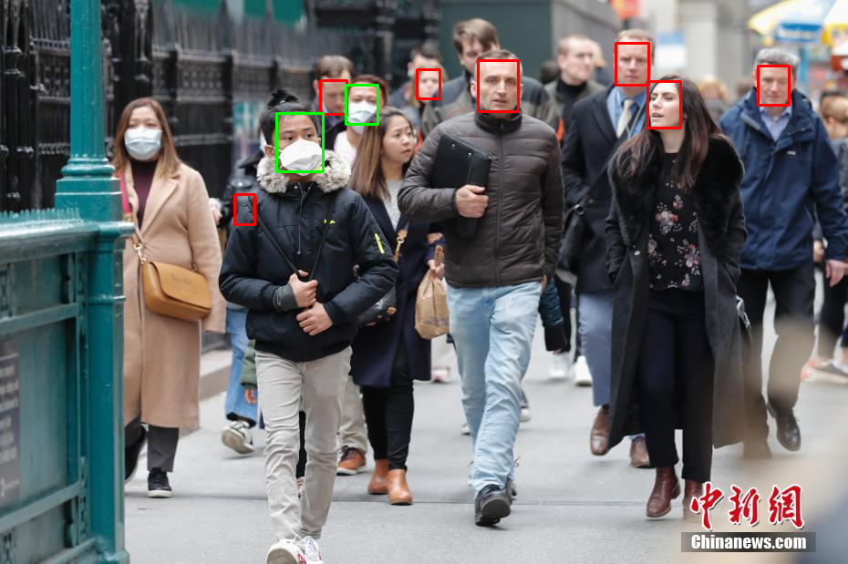

# covid_mask_detector
This project aims to, both, detect masks in a human face using a CNN, in a image of a public area, that may serve as sensor for the Corona Virus state in that region, and avaliating the impact of the use of image processing techniques in the data set of this problem, such as accuracy difference, cost/benefit ratio.

The assets used in this code includes 2 CNNs, one for mask detection coded and trained by me in the project: https://github.com/machadoprx/CoolConvNN

One for face detection:
https://github.com/ipazc/mtcnn

The face detection can also be performed by the Viola Jones algorithm instead, besides its lower accuracy the VJ is faster.

# CNN Architecture for mask detection

	</img>

# Input and output example:

  

    
  

  

    
  

